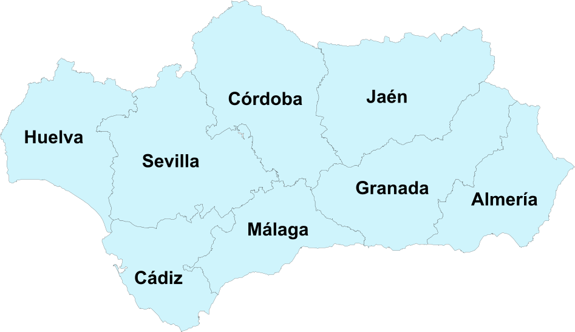

<h1 align="center">🌦️ Andalucía Weather Dashboard</h1>

An interactive web dashboard for weather visualisation and forecasting across the provinces of _Andalucía_, built with **Django** using the data generated in the previous assigment as a silver layer.

<p align="center">
  
</p>

> **Academic note:** This project goes beyond the proposed stack (Streamlit) and implements a full web architecture with Django + Gunicorn, [deployed to production](https://sbdmando.andrespradomorgaz.com/) via Cloudflare Tunnels on a self-hosted Debian server on the local network of one of the students. If you are reading this after May, 2026, the production url will probably not work.

---

## 📖 Description

This dashboard lets users explore forecasts weather data for each Andalusian province through a clean, intuitive interface. The home page features an **interactive SVG map of Andalucía** with all eight provinces as clickable regions; selecting a province navigates to detailed data tables and charts generated from the predictive models trained during earlier phases of the project.

---

## ✨ Features

- **Interactive SVG map** of _Andalucía_ with all eight provinces as clickable elements.
- **Data tables** showing weather predictions filtered by province.
- **Dynamic charts** generated with Plotly from each province's dataset.
- Production server with **Gunicorn** and public exposure via **Cloudflare Tunnels**.
- Dependency and virtual environment management with **uv**.

---

## 🖥️ Production Deployment

The project is deployed [here](https://sbdmando.andrespradomorgaz.com/), using a **Debian** server on the local network, exposed to the internet via **Cloudflare Tunnels** without the need to open any ports on the router.

---

## 🛠️ Tech Stack

| Layer                    | Technology            |
| ------------------------ | --------------------- |
| Web framework            | Django (Python based) |
| WSGI server (production) | Gunicorn              |
| Environment management   | uv                    |
| Visualisation            | Plotly                |
| Data processing          | Polars                |
| Interactive map          | Native SVG            |
| Internet tunnel          | Cloudflare Tunnels    |
| Production server OS     | Debian                |

---

## 📁 Project Structure

```
.
├── config/                 # Django project configuration
│   ├── settings.py
│   ├── urls.py
│   └── wsgi.py
├── data_silver_layer/      # Datasets produced in the previous assigment
├── static/                 # CSS and static assets
├── weather/                # Main Django app
│   ├── templates/          # HTML templates (SVG map, tables, charts)
│   ├── views.py            # Main business logic (controller in traditional ModelViewController architecture)
│   ├── urls.py
│   └── models.py
├── .env                    # Environment variables (not commited, example below)
|-- .gitignore
|-- manage.py
├── pyproject.toml          # Dependencies managed by uv
└── README.md
```

---

## 🚀 Local Installation & Setup

### 0. Prerequisites

- Python **3.13**
- [`uv`](https://docs.astral.sh/uv/) installed on your system:
  ```bash
  curl -LsSf https://astral.sh/uv/install.sh | sh
  ```

### 1. Clone the repository

```bash
git clone https://github.com/andpramor/iabd-sbd-3.4-cuadro_de_mando.git
cd iabd-sbd-3.4-cuadro_de_mando
```

### 2. Install dependencies (uv will create the virtual environment automathically)

```bash
uv sync
```

### 3. Configure environment variables

Copy the template and fill in your values:

```bash
cp .env.example .env
```

Edit the `.env` file with your values (see the [Environment Variables](#-environment-variables) section).

### 4. Start the development server

```bash
python manage.py runserver
```

The application will be available at [http://127.0.0.1:8000](http://127.0.0.1:8000).

---

## 🔐 Environment Variables

The project requires a `.env` file in the root directory with the following variables:

```env
# Django secret key (generate one with: python -c "from django.core.management.utils import get_random_secret_key; print(get_random_secret_key())")
SECRET_KEY=<your_secret_key_here>

# Debug mode (True in development, False in production)
DEBUG=True

# Allowed hosts, comma-separated
ALLOWED_HOSTS="127.0.0.1,localhost"
```

---

## 👤 Authors

Project developed by Andrés Prado Morgaz (@andpramor) and Manuel J. de la Rosa Cosano (@Nastupiste).
